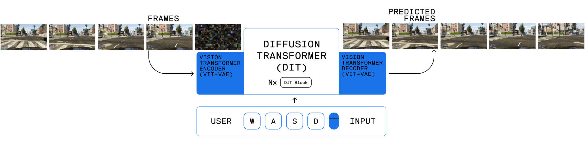

<p align="center">
    <br>
    
    <h2 align="center"><i>AI Generated GTAV</i></h2>


<p align="center">
    <a href="https://twitter.com/intent/tweet?text=&url=https%3A%2F%2Fgithub.com%2Fikergarcia1996%2FAI-Generated-GTAV"></a>
    <a href="https://github.com/ikergarcia1996/AI-Generated-GTAV/blob/main/LICENSE"></a>
    <a href="https://huggingface.co/Iker/AI-Generated-GTA-V"></a>
    <a href="https://huggingface.co/datasets/Iker/GTAV-Driving-Dataset"></a>
    <a href="https://visitor-badge.laobi.icu/badge?page_id=ikergarcia1996.aigtav"></a>
    <a href="https://ikergarcia1996.github.io/Iker-Garcia-Ferrero/"></a>
    <br>
     <br>
</p>


A Deep Learning project that uses Diffusion transformers (DiT) to generate  Grand Theft Auto V driving footage.
This project is based on the  [Open-Oasis Project](https://github.com/etched-ai/open-oasis)

<table>
<tr>
<td>  </td>
<td>  </td>
</tr>
</table>


If you enjoy this repo, you can also see [🤖 TEDD1104 Self Driving Car on GTAV](https://github.com/ikergarcia1996/Self-Driving-Car-in-Video-Games)


## Overview



This project implements a diffusion-based video generation model trained on GTA V gameplay footage. The model uses a combination of:
- Vision Transformer (ViT) for encoding/decoding frames
- Diffusion Transformer (DiT) for the generative process
- Optional action conditioning for controlled generation

We provide:
- 🤖 Pretrained Models
- 🚀 Inference code for generating new driving sequences
- 💻 Complete training pipeline
- 📊 Full training dataset with 1,2M driving sequences


> ⚠️ This is a personal exploration project for video diffusion models. The code prioritizes readability and visualization over performance. While functional, results may be imperfect due to limited training. Feel free to experiment with the code!


### Requirements

- Python 3.8+
- PyTorch 2.0+ 
- Torch Vision 
- PyTorch Image Models
- Hugging Face Accelerate
- Hugging Face Transformers
- Hugging Face Datasets
- Wandb (for logging)

```bash
pip install --upgrade torch torchvision transformers accelerate datasets einops wandb webdataset matplotlib timm 
```


# Running Inference

First download the 🤖 Pretrained Models from 🤗[Iker/AI-Generated-GTA-V](https://huggingface.co/Iker/AI-Generated-GTA-V). 
Then run inference using:

```bash
python3 generate.py \
--total-frames 32 \
--dit_model_path download_path/dit.safetensors \
--vae_model_path download_path/vit-l-20.safetensors \
--noise_steps 100 \
--output_path your_video.mp4
```

This will generate a 32 frame sequence starting from a random 5 frame sequence from the test dataset. If you want to start from a custom image you can use:


```bash
python3 generate.py \
--total-frames 32 \
--dit_model_path download_path/dit.safetensors \
--vae_model_path download_path/vit-l-20.safetensors \
--noise_steps 100 \
--output_path your_video.mp4 \
--start_frame images/start_image_1.jpg
```

If you want to enable `action conditioning` add the `--use_actions` flag, by default all the actions will be pressing the key `W` to go forward. You should use the `dit_action.safetensors` model for this. 
```bash
python3 generate.py \
--total-frames 32 \
--dit_model_path download_path/dit_action.safetensors \
--vae_model_path download_path/vit-l-20.safetensors \
--noise_steps 100 \
--output_path your_video_action_conditioning.mp4 \
--use_actions
```

# Training your own model

The 📊 Full training dataset with 1,2M driving sequences is available in [Iker/GTAV-Driving-Dataset](https://huggingface.co/datasets/Iker/GTAV-Driving-Dataset). 

In order to train your own model you first need to create a configuration file. See [configs/train_dit_actions.yaml](configs/train_dit_actions.yaml) for an example of a training config `with action conditioning` and [configs/train_dit.yaml](configs/train_dit_actions.yaml) for an example of a training config `withour action conditioning`. 

### Config params

Most of the params in the config files are self-explanatory, just a few tips. You can choose between `dataset_type: hfdataset` and `hfdataset: webdataset`. `hfdataset` is the most stable and faster setting, but it will download the entire dataset into your disk (~130GB) and then it will load the dataset into your RAM. So it required A LOT OF RAM. `webdataset` will stream the dataset from the hfrepo so you will only store ~6gb chunks into RAM at a time. It is more efficent but webdataset is more unestable and you might get connection errors. 

The training will store the latest checkpoint in the output folder, if you set `resume_from_checkpoint: true` if a checkpoint exists, we will restore the training (optimizer, step, scheduler, dataset, etc...) from the checkpoint. 

You can run the training with the following command, it will use as many GPUs as available (Data Parallelism):
```
accelerate launch --mixed_precision bf16 train_dit.py configs/train_dit_actions.yaml
``` 

See [train_scripts/](train_scripts/) for a slurm example to launch the training runs.

# Video samples

See [videos/with_action_conditioning](videos/with_action_conditioning) for samples of videos with `action_conditioning` and [videos/without_action_conditioning](videos/without_action_conditioning) for samples of videos wihtout `action_conditioning`. 

